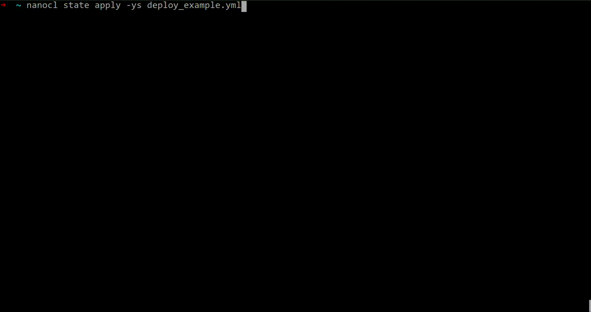
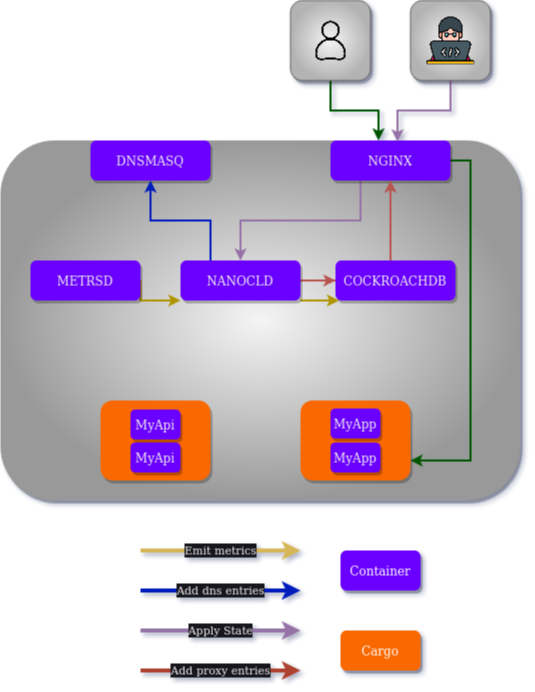

<div align="center">
  
  <h1>Nanocl</h1>
  <p>

[](https://github.com/next-hat/nanocl)
[](https://github.com/next-hat/nanocl)
[](https://discord.gg/WV4Aac8uZg)

  </p>

  <p>

[](https://github.com/next-hat/nanocl/actions/workflows/tests.yml)
[](https://github.com/next-hat/nanocl/actions/workflows/clippy.yml)

  </p>

  <p>

[](https://codecov.io/gh/next-hat/nanocl)

  </p>

</div>

<blockquote>
 <span>
   Test, Deploy, Scale, Monitor, Orchestrate
 </span>
</blockquote>

## ❓ Why Nanocl

`Nanocl` is all about easing your container and VM management with Rust-powered platform.
With `Nanocl`, say goodbye to complex setups and hello to easy, efficient deployments.
We stand for robust performance and efficiency with simplicity, trimming the bloat to keep your systems lean.
**_Join us and help shape the future of cloud computing - it's about time things got a bit more rusty_**.

## 📙 Table of Contents

- [❓ Why Nanocl ?](#-why-nanocl)
- [📙 Table of Contents](#-table-of-contents)
- [🚀 Key Benefits](#-key-benefits)
- [🔧 Usage](#-usage)
- [📺 Demo](#-demo)
- [🧿 Architecture](#-architecture)
- [📚 Documentation](#-documentation)
- [📋 Requirements](#-requirements)
- [💾 Installation](#-installation)
- [👨‍💻 Contributing](#-contributing)
- [💎 Sponsors](#-sponsors)
- [⭐️ Show your support](#️-show-your-support)

## 🚀 Key Benefits

- Easy deployment and management
- Significantly reduce the delay between writing code and shipping it to production
- Efficiently manage and scale your infrastructure as your needs evolve
- Enhance security by isolating services using namespaces and networks.
- Enjoy peace of mind with automatic backups, zero downtime fail-over, and comprehensive log monitoring
- Enjoy history tracking of your container and virtual machine configuration
- Revert configuration as quickly as pressing a button
- Build an entire CI/CD pipeline, from tests to high-availability production
- Best ideas and practices from the community

## 🔧 Usage

`Nanocl` is designed to be easy to operate by mostly using **Statefiles**.<br />
**Statefiles** are `yaml` files that define the state you want.<br />
There is an example used to deploy our [documentation][documentation]:

```yaml
ApiVersion: v0.14

# See all options:
# https://docs.next-hat.com/references/nanocl/objects/cargo
Cargoes:
- Name: doc
  Container:
    Image: ghcr.io/next-hat/documentation:0.13.0

# See all options:
# https://docs.next-hat.com/references/nanocl/objects/resource
Resources:
- Name: docs.next-hat.com
  Kind: ncproxy.io/rule/v0.10
  Data:
    Rules:
    - Domain: docs.next-hat.com
      Network: Public
      Locations:
      - Path: /
        Target:
          Key: doc.global.c
          Port: 80
```

To apply a state we can do it easily bu running `nanocl state apply -s path|url`<br />
We can also revert a state by calling `nanocl state rm -s path|url`<br />

## 📺 Demo

Demo of `Nanocl` in action when applying `example/deploy_example.yml`:

<div align="center">
  
</div>

## 🧿 Architecture

`Nanocl` is designed in a **micro services** architecture several component are required and they are running as **container** included the `Nanocl Daemon` itself.
The following components will be installed during `nanocl setup` and are required to ensure `Nanocl` functionality:

- `nstore` to save our state
- `ndaemon` as **REST API** to manage everything
- `nmetrics` to monitor cpu, memory and network usage
- `nproxy` proxy to redirect traffic to our **containers** and **virtual machines**
- `ncproxy` to update proxy configuration based on the current state
- `ndns` to manage the dns entries for the **containers** and **virtual machines**
- `ncdns` to update dns entries based on the current state

Simplified version of our architecture for a single node:

<div align="center">
  
</div>

## 📚 Documentation

To learn more about `Nanocl`, you can take a look at the following resources:

- [Overview][nanocl_overview]
- [Get Started][nanocl_get_started]
- [CLI References][nanocl_cli_ref]
- [DAEMON References][nanocl_daemon_ref]

## 📋 Requirements

To work properly `Nanocl` must have theses dependencies installed on the system:

- [Docker][docker] minimum version 1.41

## 💾 Installation

To install `Nanocl`, please refer to our online [installation guide][nanocl_install_guide].


## 👨‍💻 Contributing

Every contribution is very welcome.

But to be able to do so you need a dev environnement right ?<br />
You can learn more about it on the [contribution guide][contributing_guide].<br />
Also don't hesitate to join the [discord][discord] if you have any question!

## 💎 Sponsors

Huge thanks to our sponsors

<table>
  <tr>
  <td align="center">
    <a href="https://github.com/mamaicode">
      
      <br />
      <sub>
        <b>
          Mamaicode
        </b>
      </sub>
    </a>
  </td>
  <td align="center">
    <a href="https://github.com/xf10w">
      
      <br />
      <sub>
        <b>
          xf10w
        </b>
      </sub>
    </a>
  </td>
  </tr>
</table>

## ⭐️ Show your support

Give a ⭐️ if this project helped you!

[contributing_guide]: ./CONTRIBUTING.md
[documentation]: https://docs.next-hat.com
[nanocl_overview]: https://docs.next-hat.com/guides/nanocl/overview
[nanocl_install_guide]: https://docs.next-hat.com/manuals/nanocl/install/overview
[nanocl_get_started]: https://docs.next-hat.com/guides/nanocl/get-started/orientation-and-setup
[nanocl_cli_ref]: https://docs.next-hat.com/references/nanocl/cli
[nanocl_daemon_ref]: https://docs.next-hat.com/references/nanocl/daemon/overview
[docker]: https://www.docker.com
[discord]: https://discord.gg/WV4Aac8uZg
