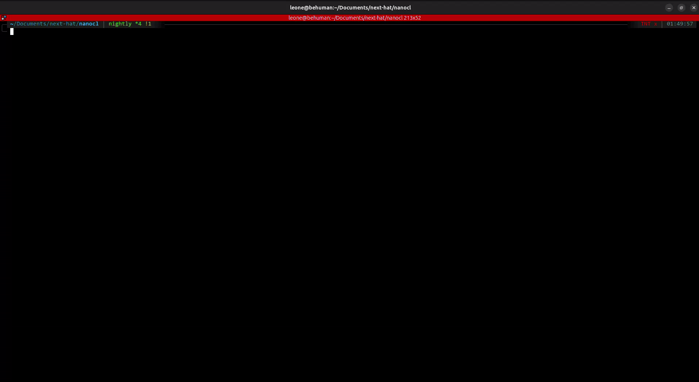
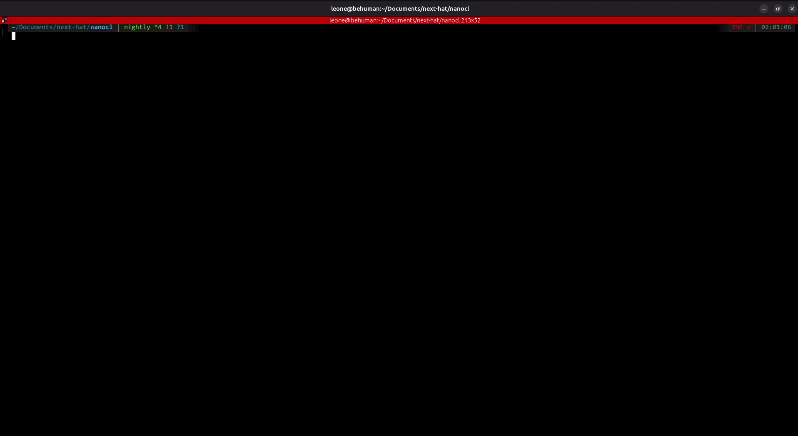

<div align="center">
  
  <h3>Develop, Distribute</h3>
  <p align="center">
    <a href="https://next-hat.com/nanocl" target="_blank"><b>Docs</b></a> •
    <a href="https://github.com/next-hat/nanocl/tree/nightly/examples" target="_blank"><b>Examples</b></a> •
    <a href="https://discord.gg/WV4Aac8uZg" target="_blank"><b>Discord</b></a>
  </p>
  <p>

[](https://github.com/next-hat/nanocl/actions/workflows/tests.yml)
[](https://github.com/next-hat/nanocl/actions/workflows/clippy.yml)

  </p>

  <p>

[](https://codecov.io/gh/next-hat/nanocl)

  </p>

</div>

<blockquote>
 <span>
   Test, Deploy, Scale, Monitor, Orchestrate
 </span>
</blockquote>


**Nanocl** is an open-source distributed system designed to revolutionize developers' workflows.<br/>
It aims to provide an easy solution for localhost development, addressing common issues like CORS and cookies when working with complex microservice architectures.<br/>
Nanocl also facilitates seamless deployment to production.<br/>
By empowering developers and DevOps professionals, Nanocl helps optimize workflows, enhance security, and reduce operational costs.

**Join our *[discord][discord]* and help us shape the future of infrastructure management.**

## Latest news

- [2024/06/11] [Man page, Backup, Remove Orphans and more](https://docs.next-hat.com/blog/nanocl-0.15) (release)
- [2024/06/01] [We are invited to the Merge Berlin 2024](https://www.linkedin.com/feed/update/urn:li:activity:7201921660289998850) (event)
- [2024/05/07] [Context, SubState and more](https://docs.next-hat.com/blog/nanocl-0.14) (release)

## Installation

To install **Nanocl** for your system, please refer to our online [installation guide][nanocl_install_guide].

## Documentation

To learn more about **Nanocl**, you can take a look at the following resources:

- [Overview][nanocl_overview]
- [Get Started][nanocl_get_started]
- [CLI References][nanocl_cli_ref]
- [DAEMON References][nanocl_daemon_ref]

## Usage

**Nanocl** is designed to be easy to operate by mostly using **Statefiles**.<br />
**Statefiles** are `yaml`, `toml` or `json` files that define the state you want.<br />
There is an example used to deploy our [documentation][documentation]:

```yaml
ApiVersion: v0.14

# See all options:
# https://docs.next-hat.com/references/nanocl/objects/cargo
Cargoes:
- Name: doc
  Container:
    Image: ghcr.io/next-hat/documentation:0.14.0

# See all options:
# https://docs.next-hat.com/references/nanocl/objects/resource
Resources:
- Name: docs.next-hat.com
  Kind: ncproxy.io/rule
  Data:
    Rules:
    - Domain: docs.next-hat.com
      Network: Public
      Locations:
      - Path: /
        Target:
          Key: doc.global.c
          Port: 80
```

To apply a state you can do it easily bu running `nanocl state apply -s path|url`<br />
You can also remove a state by calling `nanocl state rm -s path|url`<br />

## Demo

Below are live demos of **Nanocl** in action:

### Cargo and Resource

<div align="center">
  
</div>

### Job

<div align="center">
  
</div>

### Vm

<div align="center">
  
</div>

## Architecture

**Nanocl** is designed in a **micro services** architecture several component are required and they are running as **container** included the **Nanocl Daemon** itself.
The following components will be installed during `nanocl install` and are required to ensure **Nanocl** functionality:

- `nstore` to save our state
- `ndaemon` as **REST API** to manage everything
- `nmetrics` to monitor cpu, memory and network usage
- `nproxy` proxy to redirect traffic to our **containers** and **virtual machines** (optional)
- `ncproxy` to update proxy configuration based on the current state (optional)
- `ndns` to manage the dns entries for the **containers** and **virtual machines** (optional)
- `ncdns` to update dns entries based on the current state (optional)

Simplified version of our architecture for a single node:

<div align="center">
  
</div>

## Contributing

Every contribution is very welcome.
Bug reports, feature requests, and pull requests are the most common ways to contribute.

You can also help us by improving the [documentation][documentation_repository].

Learn how to setup a development environment by reading the [contribution guide][contributing_guide].
Also don't hesitate to join the [discord][discord] if you have any question!

## Sponsors

Sponsors are the ones who make this project possible. They help us to keep the project alive and to improve it. If you want to become a sponsor, you can do so by clicking on the sponsor button. <br/>

People that sponsor us will have their name or logo displayed here, and will have access to a special role on our discord server.

**If you sponsor for more then 40$ you will be rewarded with a VPS server with nanocl pre-installed ready to use for 1 month.** <br/>

You can also help us by contributing to the project, by reporting bugs, by suggesting new features, or by improving the [documentation][documentation_repository].

**Or just give a star it's free and it helps us a lot! ⭐️**


**Huge thanks to our sponsors**


<table>
  <tr>
  <td align="center">
    <a href="https://github.com/mamaicode">
      
      <br />
      <sub>
        <b>
          Mamaicode
        </b>
      </sub>
    </a>
  </td>
  <td align="center">
    <a href="https://github.com/xf10w">
      
      <br />
      <sub>
        <b>
          xf10w
        </b>
      </sub>
    </a>
  </td>
  </tr>
</table>


[contributing_guide]: ./CONTRIBUTING.md
[documentation]: https://docs.next-hat.com
[nanocl_overview]: https://docs.next-hat.com/guides/nanocl/overview
[nanocl_install_guide]: https://docs.next-hat.com/manuals/nanocl/install/overview
[nanocl_get_started]: https://docs.next-hat.com/guides/nanocl/get-started/orientation-and-setup
[nanocl_cli_ref]: https://docs.next-hat.com/references/nanocl/cli
[nanocl_daemon_ref]: https://docs.next-hat.com/references/nanocl/daemon/overview
[docker]: https://www.docker.com
[discord]: https://discord.gg/WV4Aac8uZg
[documentation_repository]: https://github.com/next-hat/documentation
