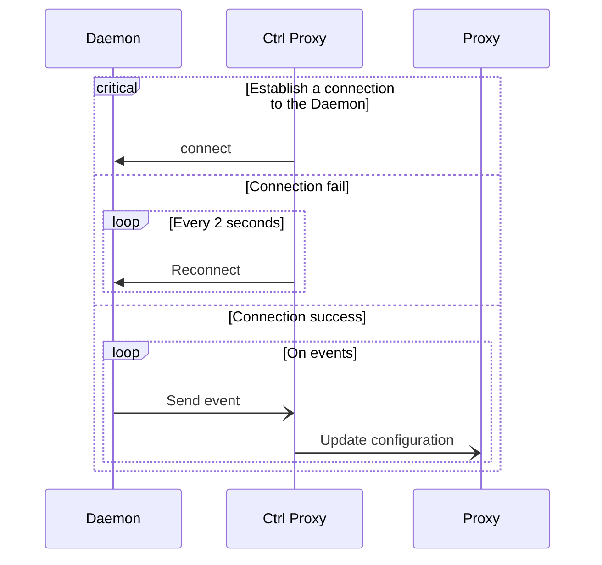

<div align="center">
  
  <h1>Nanocl Controller Proxy</h1>
  <p>

  [](https://github.com/nxthat/nanocl)
  [](https://github.com/nxthat/nanocl)
  [](https://discord.gg/WV4Aac8uZg)

  </p>

  <p>

  [](https://github.com/nxthat/nanocl/actions/workflows/tests.yml)
  [](https://github.com/nxthat/nanocl/actions/workflows/clippy.yml)

  </p>

  <p>

  [](https://codecov.io/gh/nxthat/nanocl)

  </p>

</div>

The official [nanocl](https://github.com/nxthat/nanocl) controller proxy build on top of nginx.

This microservice watch event sent by the nanocl daemon to generate nginx config file to enable exposition of your cargo.

## Architecture



The controller proxy will watch for events:
- Resource type `ProxyRule`:
  * Creation, Update, Suppresion
- Cargo:
  * Creation, Update, Suppression

## Installation


### Production

You need to have nanocl installed on your system, see how to install in our [documentation](https://docs.next-hat.com/setups/nanocl/).

Then you need to download our images:

```sh
docker pull ghcr.io/nxthat/nanocl-proxy:latest
docker pull ghcr.io/nxthat/ncdproxy:latest
```

### Development

You still need to have nanocl installed on your system.

Build dev and test image

```sh
docker build -t nanocl-proxy:test -f ./nginx/Dockerfile .
docker build -t nanocl-proxy:dev -f ./nginx/Dockerfile .
docker build -t nanocl-ncdproxy:dev -f dev.Dockerfile .
```

Apply nanocl dev state

```
nanocl state apply -af ./nanocl/dev.yml
```
