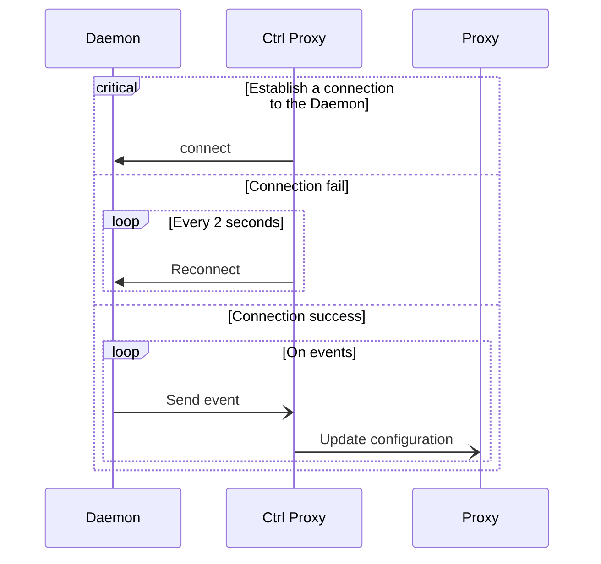

  
  <h1>Nanocl Controller Proxy</h1>
  

  

  

  

  

  

The official [nanocl](https://github.com/next-hat/nanocl) controller proxy build on top of nginx.

This microservice watch event sent by the nanocl daemon to generate nginx config file to enable exposition of your cargo.

## Architecture

The controller proxy will watch for events:

- Resource type `ncproxy.io/rule`:
  - Creation, Update, Suppresion
- Cargo,Vm:
  - Creation, Update, Suppression
