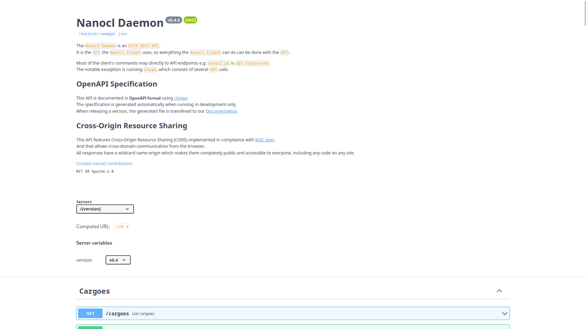

# Contribution guide

Joining an unknown project can be difficult, even if you have some experience.<br />
This documentation will help you to setup `Nanocl` in development.<br />
Note: `Nanocl` heavily utilizes [ntex](https://ntex.rs) as **client** and **server**

## 📙 Table of Contents

- [📁 Project Structure](#-project-structure)
- [💾 Installation](#-installation)
  - [🐧 Ubuntu](#-ubuntu)
  - [🦀 Rust](#-rust)
- [🏃 Running](#-running)
  - [🐋 Docker Desktop](#-docker-desktop)
- [🧪 Testing](#-testing)
- [👌 Usefull Command](#-usefull-command)

## 📁 Project Structure

`Nanocl` is using a **mono repository structure**.<br />

```sh
bin # Binaries (executable)
├── nanocl # Nanocl CLI
│   └── src # Rust source code
│       ├── commands # Function that executes commands
│       ├── models # Data structure used for the project
│       └── utils # Utils functions for the project
├── nanocld # Nanocl DAEMON REST API
│   ├── migrations # SQL table definition to generate schema.rs with diesel
│   ├── specs # OpenApi specification
│   └── src # Rust source code
│       ├── models # Data structure used for the project
│       ├── repositories # Functions to make SQL requests
│       ├── services # Function to accept http requests
│       ├── subsystem # Function executed before starting the server
│       └── utils # Utils functions for the project
├── ncddns # Nanocl Controller Daemon DNS REST API
│   ├── specs # OpenApi specification
│   ├── tests # Test configurations
│   └── src # Rust source code
├── ncdproxy # Nanocl Controller Daemon PROXY REST API
│   ├── specs # OpenApi specification
│   ├── tests # Test configuration
│   └── src # Rust source code
├── ndns # Source to build custom dnsmasq container image
└── nproxy # Source to build custom nginx container image
crates # Shared Libraries
├── nanocld_client # A nanocld client
│   └── src # The rust source code
├── nanocl_utils # A collection of utils used in the project
│   └── src # The rust source code
└── nanocl_stubs # Shared data structure mostly used as input and output of out DAEMON
    └── src # The rust source code
```

## 💾 Installation

Clone the repository:

```sh
git clone https://github.com/nxthat/nanocl
```

To build and run `Nanocl` you will need these dependencies

- [rust](https://www.rust-lang.org) >= 1.67
- [docker](https://www.docker.com) >= 1.41
- gcc
- make
- libpq-dev
- openssl-dev

### 🐧 Ubuntu

If you are running ubuntu, the following scripts will install the required dependencies:

```sh
./scripts/ubuntu.deps.sh
```

If you need docker:

```sh
./scripts/install_docker.ubuntu.sh
```

### 🦀 Rust

To install rust

```sh
curl --proto '=https' --tlsv1.2 -sSf https://sh.rustup.rs | sh
```

Afterwards install rust devtools required to run `Nanocl`

```sh
./scripts/rust.deps.sh
```

## 🏃 Running

Make sure your are in docker group, if not then you can add yourself:

```sh
sudo usermod -aG docker $USER
newgrp docker
```

Before running `Nanocl` we will need to download and build some docker images:

```sh
./scripts/install_dev_image.sh
```

Then spin up `Nanocl` services using `docker compose`:

```sh
docker compose up
```

### 🐋 Docker Desktop

If you can have Docker installed normally with his default socket on `/run/docker.sock` you can also change the context:

```sh
docker context ls
docker context use default
```

In case you want to be using Docker desktop, you need to update this line:

```yaml
volumes:
  - /run/docker.sock:/run/docker.sock # by /home/{your_user}/.docker/desktop/docker.sock:/run/docker.sock
```

On the `nanocld` service, afterward you can start the daemon using:

```sh
docker compose up
```

Once started, a swagger should be available on [http://localhost:8585/explorer](http://localhost:8585/explorer).

<div align="center">
  
</div>

Note that a _env variable_ could be passed to change the port, it is hardcoded for now.<br />
It could be a nice and easy first issue and pull request if you would like to help :).

To use the CLI you need correct permission on `/run/nanocl`

```sh
sudo chmod -R /run/nanocl
```

Now you can run the CLI:

- Using cargo make

  ```sh
  cargo make run-cli version
  ```

- Using cargo

  ```sh
  cargo run --bin nanocl version
  ```

## 🧪 Testing

To run tests, make sure all `Nanocl` services are running with `docker compose up`.<br/>
Then be sure to have correct permission set on `/run/nanocl`
You also need this entry in your `/etc/hosts`

```
127.0.0.1 nstore.nanocl.internal
```

- Run all tests

  ```sh
  cargo make tests
  ```

- Run all tests with print output

  ```sh
  cargo make tests-debug
  ```

- Run only daemon tests

  ```sh
  cargo make tests-daemon
  ```

- Run only cli tests
  ```sh
  cargo make tests-cli
  ```

## 👌 Usefull Command

Some usefull command to know:

- lsns - list namespaces

  ```sh
  lsns
  ```

- nsenter - run program in different namespaces

  ```sh
  sudo nsenter -t 12267 -n ss -ltu
  ```

- Generate a nanocld client

  ```sh
  docker run --rm -v $(pwd):/local openapitools/openapi-generator-cli generate -g rust -i /local/specs/v1/swagger.json -o /local/client
  ```

- Generate ssl cert from certbot
  ```sh
  nanocl cargo -n system exec nproxy -- certbot --nginx --email email@email.com --agree-tos -d your-domain.com
  ```
